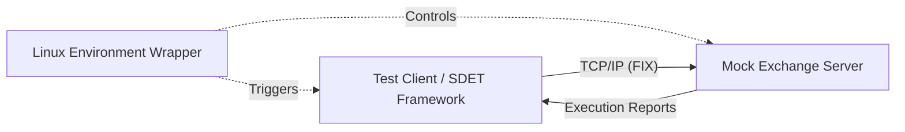

# 🏦 Crucible - FIX Exchange with Real-Time Dashboard

[](https://github.com/sc895/Crucible/actions)
[](https://www.python.org/)
[](https://behave.readthedocs.io/)
[](https://www.fixtrading.org/)
[](https://developer.mozilla.org/en-US/docs/Web/API/WebSockets_API)
[](https://sc895.github.io/Crucible/)

## 📋 Project Overview
This project is a comprehensive **FIX Exchange with Real-Time WebSocket Dashboard** designed to showcase financial technology expertise.

Built to demonstrate the responsibilities of an **SDET in High-Frequency Trading**, this system uses the **FIX (Financial Information eXchange)** protocol for order routing, features a **live WebSocket-enabled dashboard**, and includes a complete **BDD test automation framework**.

### 🎯 Key Features
* **Real-Time Trading Dashboard:** Live order book with WebSocket streaming (see `dashboard_realtime.html`)
* **FIX Protocol Implementation:** Full FIX 4.2 message handling with order matching engine
* **Test Automation:** BDD framework with 21 Gherkin scenarios using Python Behave
* **Order Generator:** Automated sample data generation for live demonstrations
* **CI/CD Integration:** Fully automated regression pipeline via GitHub Actions
* **Cross-Platform Support:** Works on Linux, macOS, and Windows (WSL)

### 🌟 Live Demo
Visit the **[Live Dashboard](https://sc895.github.io/Crucible/)** to see the real-time order book in action!

---

## 🏗️ Architecture

The system consists of three distinct components interacting in real-time:



1.  **The Mock Exchange (SUT):** A Python socket server that parses raw FIX messages, maintains an order book, and sends execution reports.
2.  **The Conformance Suite:** A BDD-based client that acts as a Trader, injecting specific scenarios (Happy Path, Edge Cases, Latency checks).
3.  **The DevOps Layer:** Shell scripts and CI pipelines that ensure clean environments for every test run.

---

## 🚀 Features & Scenarios

This framework covers the following conformance scenarios required for exchange certification:

### 1\. Connectivity & Session Layer

  * **Logon (35=A):** Validates `SenderCompID` and `TargetCompID`.
  * **Heartbeats (35=0):** Ensures session remains active during idle periods.
  * **Logout (35=5):** Graceful session termination.

### 2\. Order Management (Trade Life Cycle)

  * **New Order Single (35=D):** Submission of Limit and Market orders.
  * **Execution Reports (35=8):** Verifies `ExecType` (Fill, Partial Fill, New).
  * **Order Cancellation (35=F):** Ability to withdraw open orders.

### 3\. Risk & Validation (Negative Testing)

  * **Price Validation:** Rejects orders with Negative or Zero price.
  * **Symbol Check:** Rejects orders for symbols not in the master security list.
  * **Protocol Compliance:** Rejects malformed FIX strings (missing checksums or delimiters).

---

## 🛠️ Technology Stack

| Component | Technology Used | Relevance to Tower Research |
| :--- | :--- | :--- |
| **Language** | Python 3.9 | Core JD Requirement |
| **Protocol** | FIX 4.2 (via `simplefix`) | Financial Services Standard |
| **Framework** | Behave (Gherkin) | "Experience with BDD/TDD" |
| **OS Tools** | Linux Bash, `netstat`, `nohup` | "Competence using Linux" |
| **CI/CD** | GitHub Actions | "Familiarity with DevOps tools" |
| **Reporting** | Allure Reports | "Design test artifacts... Reporting" |

---

## 📂 Project Structure

```text
├── features/               # BDD Feature Files (Gherkin)
│   ├── environment.py      # Hooks for setup/teardown
│   ├── trading.feature     # Business scenarios
│   └── steps/              # Python step definitions
├── src/
│   ├── exchange_server.py  # FIX Engine with WebSocket support
│   └── fix_engine.py       # FIX protocol message construction
├── scripts/
│   ├── run_suite.sh        # Linux automation script
│   └── run_suite.bat       # Windows automation script
├── .github/workflows/      # CI/CD Pipeline configuration
├── dashboard_realtime.html # Real-time WebSocket dashboard
├── generate_orders.py      # Sample order generator
├── requirements.txt        # Python dependencies
└── README.md               # Documentation
```

---

## ⚡ Quick Start

### Prerequisites

  * Python 3.9+
  * Git

### Installation

```bash
git clone https://github.com/sc895/Crucible.git
cd Crucible
python -m venv venv
source venv/bin/activate  # On Windows: venv\Scripts\activate
pip install -r requirements.txt
```

### Running the Real-Time Demo

**Terminal 1 - Start Exchange Server:**
```bash
python src/exchange_server.py
```

**Terminal 2 - Generate Sample Orders:**
```bash
python generate_orders.py
```

**Terminal 3 - Open Dashboard:**
```bash
# Simply open dashboard_realtime.html in your browser
# Or use: start dashboard_realtime.html (Windows)
```

### Running Tests

**Automated Way (Recommended):**
This script kills stale processes, boots the server in the background, runs tests, and aggregates logs.

```bash
chmod +x scripts/run_suite.sh
./scripts/run_suite.sh
```

**2. The "Manual" Way (For Debugging)**
Terminal 1 (Server):

```bash
python src/exchange_server.py
```

Terminal 2 (Test Runner):

```bash
behave features/
```

**3. Generating Visual Reports**
To view the Allure test dashboard:

```bash
behave -f allure_behave.formatter:AllureFormatter -o report_results features/
allure serve report_results
```

---

## 🎨 Trading Dashboard

Access the **interactive web dashboard** for real-time monitoring:

```bash
# Option 1: Direct file open
# Double-click dashboard.html

# Option 2: With Python server
python -m http.server 8000
# Open: http://localhost:8000/dashboard.html
```

**Dashboard Features:**
- 📊 Real-time statistics and performance metrics
- 📈 Live market data for 10 major stocks
- 📝 Recent order activity with status tracking
- 🎮 Interactive controls to generate orders
- 🖥️ Console logs for monitoring server activity

**Sample Data Generator:**
```bash
python sample_data_generator.py
```

See [DASHBOARD_README.md](DASHBOARD_README.md) for detailed UI documentation.

---

## 🔄 CI/CD Pipeline

This repository uses **GitHub Actions** to ensure quality gates.

  * **Trigger:** Push to `main` or Pull Request.
  * **Job:**
    1.  Provisions an Ubuntu container.
    2.  Installs dependencies.
    3.  Boots the `exchange_server.py` as a background service.
    4.  Executes the `behave` suite.
    5.  Archives server logs as artifacts for debugging.

---

## 🔮 Future Roadmap (Tower Research Alignment)

  * **C++ Port:** Rewrite the matching engine in C++ to demonstrate low-latency coding.
  * **Database:** Integrate MongoDB to persist trade history (Audit Trail).
  * **Load Testing:** Add a scenario to flood the exchange with 10k orders/sec to test throughput.

---

**Author:** [Your Name]
*Aspiring SDET | Python | Linux | Financial Technologies*
